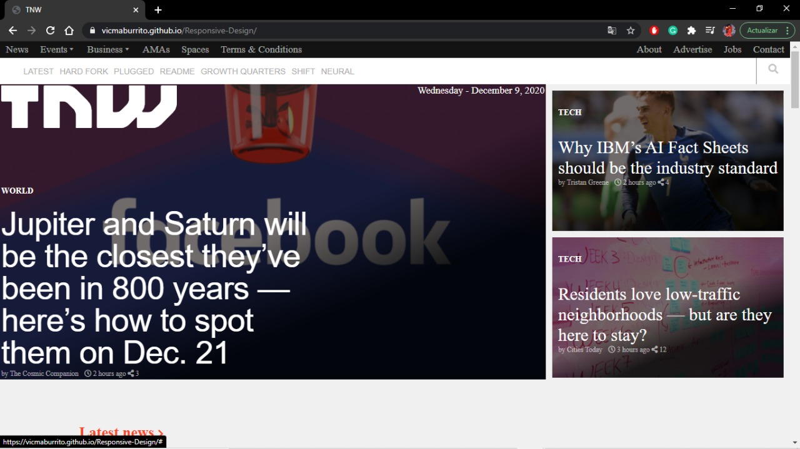

##Responsive-DHTML 2.0 - Project 2: Building with Responsive Designes

This is a clone of an article from The Next Web (https://thenextweb.com/). The code was not copied, instead, each characteristic was observed and re-developed with the knowledge acquired from the lessons taught by the program, I did the project alone, my partner left the program

##Built with

- HTML5
- CSS
- FontAwesome

## Getting Started

The project is available in one of the author's [GitHub](https://github.com/vicmaburrito/Responsive-Design) for cloning.
(https://github.com/vicmaburrito/Responsive-Design)

Manuel Aldaraca.

- Github: [@vicmaburrito](https://github.com/vicmaburrito)
- Twitter: [@ManuelAldaraca](https://twitter.com/ManuelAldaraca) 
- LinkedIn: https://www.linkedin.com/in/manuel-aldaraca 

## 🤝 Contributing

Contributions, issues, and feature requests are welcome!

Feel free to check the [issues](/).

## Show your support

Give a ⭐️ if you like this project!

## 📝 License

This project is [MIT](lic.url) licensed
